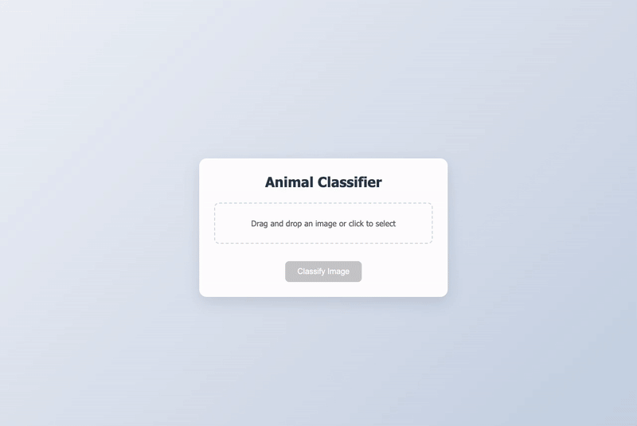

# Animal Classifier with Zero-Shot Learning



A web-based animal classification system using Zero-Shot Learning and ResNet, built with Flask and PyTorch. This application can classify animals in images without being explicitly trained on them, using semantic embeddings to make predictions.

## Features

### Core Features
- 🖼️ Real-time image classification
- 🔄 Zero-Shot Learning capabilities
- 🎯 High accuracy with ResNet backbone
- 🌐 Enhanced web interface with tabbed navigation
- 📊 Confidence scores for predictions
- 🚀 Fast inference time
- 📱 Responsive design

### Enhanced Features
- 🔧 **Dynamic Class Management**: Add/remove animal classes via API
- 📦 **Batch Processing**: Process multiple images simultaneously
- 📝 **Feedback System**: Users can correct predictions
- 📈 **Prediction History**: Track all classifications
- 🔒 **Security & Rate Limiting**: Protection against abuse
- 🐳 **Docker Support**: Easy containerized deployment
- 📚 **API Documentation**: Swagger/OpenAPI docs
- 🧪 **Testing Suite**: Comprehensive unit tests
- ⚙️ **Configuration Management**: Environment-based settings

## Live Demo

Try it out: [Animal Classifier Demo](https://animal-classifier-with-zero-shot-learning.herokuapp.com)

## Technology Stack

- **Backend**: Python, Flask
- **Deep Learning**: PyTorch, ResNet
- **Frontend**: HTML5, CSS3, JavaScript
- **Image Processing**: PIL, OpenCV
- **Vector Similarity**: scikit-learn

## Installation

### Quick Start with Docker (Recommended)

1. Clone the repository:
```bash
git clone https://github.com/jmrashed/Animal-classifier-with-zero-shot-learning.git
cd Animal-classifier-with-zero-shot-learning
```

2. Deploy with Docker:
```bash
chmod +x deploy.sh
./deploy.sh
```

The application will be available at `http://localhost`

### Manual Installation

1. Clone the repository:
```bash
git clone https://github.com/jmrashed/Animal-classifier-with-zero-shot-learning.git
cd Animal-classifier-with-zero-shot-learning
```

2. Create and activate a virtual environment:
```bash
python -m venv venv
source venv/bin/activate  # For Linux/Mac
# or
venv\Scripts\activate  # For Windows
```

3. Install dependencies:
```bash
pip install -r requirements_enhanced.txt
```

4. Run the enhanced application:
```bash
python app_enhanced.py
```

The application will be available at `http://localhost:5001`

## Project Structure

```
Animal-classifier-with-zero-shot-learning/
│
├── app.py                 # Main Flask application
├── requirements.txt       # Python dependencies
│
├── models/
│   ├── __init__.py
│   └── resnet_model.py   # ResNet model configuration
│
├── utils/
│   ├── __init__.py
│   └── preprocess.py     # Image preprocessing utilities
│
├── static/
│   ├── css/
│   └── js/
│
├── templates/
│   └── index.html        # Web interface
│
├── uploads/              # Temporary image storage
└── README.md
```

## API Endpoints

### Classification
- `POST /upload` - Upload single image for classification
- `POST /api/batch` - Process multiple images (max 10)

### Class Management
- `GET /api/classes` - Get all available classes
- `POST /api/classes` - Add new animal class
- `DELETE /api/classes/{name}` - Delete animal class

### Feedback & History
- `POST /api/feedback` - Submit feedback for predictions
- `GET /api/history` - Get prediction history

### Documentation
- `GET /docs/` - Interactive API documentation (Swagger UI)

### Example Requests

**Single Image Classification:**
```bash
curl -X POST -F "file=@image.jpg" http://localhost:5001/upload
```

**Add New Class:**
```bash
curl -X POST -H "Content-Type: application/json" \
  -d '{"name":"lion","embedding":[0.1,0.2,0.3]}' \
  http://localhost:5001/api/classes
```

**Submit Feedback:**
```bash
curl -X POST -H "Content-Type: application/json" \
  -d '{"image":"test.jpg","prediction":"cat","confidence":95.5,"correct_class":"dog"}' \
  http://localhost:5001/api/feedback
```

## Zero-Shot Learning

This classifier uses Zero-Shot Learning to predict animal classes without being explicitly trained on them. It works by:

1. Extracting visual features using ResNet
2. Projecting features to a semantic embedding space
3. Comparing embeddings with predefined class embeddings
4. Making predictions based on similarity scores

Currently supported animal classes:
- Cat
- Dog
- Horse
- Zebra
- Elephant

## Development

### Adding New Animal Classes

**Via API (Recommended):**
```bash
curl -X POST -H "Content-Type: application/json" \
  -d '{"name":"tiger","embedding":[0.6,0.3,0.8]}' \
  http://localhost:5001/api/classes
```

**Via Web Interface:**
1. Go to the "Manage Classes" tab
2. Enter class name and embedding values
3. Click "Add Class"

### Running Tests

```bash
# Run all tests
python -m pytest tests/

# Run with coverage
python -m pytest tests/ --cov=app_enhanced

# Run specific test
python -m pytest tests/test_app.py::TestAnimalClassifier::test_add_class
```

### Configuration

Set environment variables in `.env` file:
```bash
SECRET_KEY=your-secret-key
FLASK_ENV=production
MODEL_DEVICE=cuda  # or cpu
RATELIMIT_DEFAULT=100 per hour
LOG_LEVEL=INFO
```

### Docker Development

```bash
# Build image
docker build -t animal-classifier .

# Run container
docker run -p 5001:5001 animal-classifier

# Development with volume mounting
docker run -p 5001:5001 -v $(pwd):/app animal-classifier
```

## Contributing

1. Fork the repository
2. Create a feature branch (`git checkout -b feature/AmazingFeature`)
3. Commit changes (`git commit -m 'Add AmazingFeature'`)
4. Push to branch (`git push origin feature/AmazingFeature`)
5. Open a Pull Request

## License

Distributed under the MIT License. See `LICENSE` for more information.

## Contact

Md Rasheduzzaman - [@jmrashed](https://twitter.com/jmrashed) - jmrashed@gmail.com

Project Link: [https://github.com/jmrashed/Animal-classifier-with-zero-shot-learning](https://github.com/jmrashed/Animal-classifier-with-zero-shot-learning)

## Acknowledgments

- [PyTorch](https://pytorch.org)
- [Flask](https://flask.palletsprojects.com)
- [ResNet Paper](https://arxiv.org/abs/1512.03385)
- [Zero-Shot Learning Review](https://arxiv.org/abs/1907.11978)